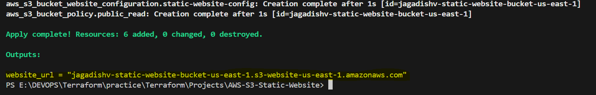

# 🌐 AWS S3 Static Website Hosting using Terraform

This project shows how to **host a static website on AWS S3** using **Terraform**. It automates everything — from creating an S3 bucket to uploading your HTML files and making the website publicly accessible.

---

## 🚀 Project Overview

I'm using **Terraform** (Infrastructure as Code tool) to automatically create and configure:
- An **AWS S3 bucket**
- Static website hosting settings
- Public access policies
- Uploading `index.html` and `error.html` files
- Outputs the final website URL

> ✅ Great for personal websites, portfolios, blogs, or any static HTML pages!

---

## 📋 Prerequisites

Before you begin, make sure you have:

- An **AWS Account**
- **Terraform** installed → [Install Guide](https://developer.hashicorp.com/terraform/downloads)
- **AWS CLI** installed → [Install Guide](https://docs.aws.amazon.com/cli/latest/userguide/install-cliv2.html)
- Basic knowledge of AWS and HTML

---

## 🛠️ Project Setup

### 1️⃣ Clone or Download This Repository

```bash
git clone https://github.com/Jagadish0716/Terraform.git
cd Terraform/Projects/terraform-s3-static-website
```

---

### 2️⃣ Configure AWS Credentials

Use the AWS CLI to set up your credentials:

```bash
aws configure
```

Provide your AWS Access Key, Secret Key, region (e.g., `ap-south-1`), and output format.

---

### 3️⃣ Add Website Files

Make sure you have:
- `index.html`
- `error.html`

Place them in the same directory as your Terraform files.

---

### 4️⃣ Terraform Files Breakdown

- **`provider.tf`** – Defines the AWS region.
- **`variables.tf`** – Stores the AWS region as a variable.
- **`resources.tf`** – Creates the S3 bucket, configures website hosting, uploads files, and sets permissions.
- **`outputs.tf`** – Outputs the website URL.

---

### 5️⃣ Deploy with Terraform

**Initialize Terraform:**

```bash
terraform init
```

**Apply the Configuration:**

```bash
terraform apply -auto-approve
```

📎 You’ll see the website URL in the terminal output.

---

## 🌍 Access Your Website

Copy the output URL (something like `http://your-bucket-name.s3-website-ap-south-1.amazonaws.com`) and open it in your browser. Your static site is live!

---


## 🧹 To Clean Up (Optional)

If you want to delete everything created by Terraform:

```bash
terraform destroy -auto-approve
```

---

## 📦 Folder Structure

```
terraform-s3-static-website/
├── provider.tf
├── variables.tf
├── resources.tf
├── outputs.tf
├── index.html
└── error.html
```
